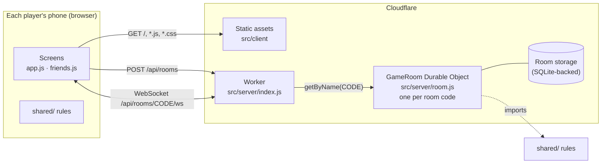

# Symbolic

Symbolic is a spot-the-match card game, based on Dobble (also sold as Spot It!), that people play on their phones, alone against a timer or together from anywhere by sharing a link. Every two cards share exactly one symbol; the first player to spot it wins the round.

It runs on Cloudflare Workers: one deploy serves the app and hosts the multiplayer game rooms.

> Dobble is a trademark of Asmodee; this project is not affiliated with it.

## Contents

- [Quick start](#quick-start)
- [How the game plays](#how-the-game-plays)
- [Architecture](#architecture)
- [How the deck is built](#how-the-deck-is-built)
- [Multiplayer protocol](#multiplayer-protocol)
- [Project layout](#project-layout)
- [Testing](#testing)
- [Deploying](#deploying)
- [Design decisions and limits](#design-decisions-and-limits)

## Quick start

Requirements: Node.js 22 or later (developed on Node 25; `npm test` relies on glob patterns in `node --test`). Python 3 is only needed for the Python reference implementation.

```sh
npm install        # installs Wrangler, Cloudflare's CLI, locally
npm run dev        # runs the app and game rooms locally at http://localhost:8787
npm test           # JavaScript tests
```

To try it on a phone on the same Wi-Fi, run `npx wrangler dev --ip 0.0.0.0` and open `http://<your computer's local IP>:8787` on the phone.

## How the game plays

Players pick a level, which sets how many symbols each card has: Easy (6), Medium (8) or Hard (12). The levels are `LEVELS` in `shared/generator.js`. The deck generator and the room API also accept 3 or 4, but the app no longer offers them. The deck is capped at 57 cards, because the full deck for 12 symbols per card would have 133.

The home screen shows a "New here? Play the tutorial" button, a box for joining a game with a room code, and a big round card holding "Play solo game" and "Play with friends". Tapping either one turns the card over to choose a level; for solo play the card also has a toggle between the two solo modes. The tutorial isn't built yet: its button only says it's coming soon. Buttons on the home screen grow slightly when pressed.

On every screen the centre card is on top and the player's own card is below. Tapping the one symbol the two cards share scores; a tap counts as soon as the finger touches the screen.

**Solo modes** (run entirely on the phone):

| Mode | Goal |
|---|---|
| Beat the clock | As many matches as possible in 60 seconds. The deck is reshuffled if you get through it. |
| Race the deck | Get through the whole deck as fast as possible. |

Best scores are saved on the phone, separately for each mode and card size.

**Multiplayer modes** (one game room shared over the internet, 2 to 8 players, each on their own phone):

| Mode | Setup | Spotting the match… | Winner |
|---|---|---|---|
| Pick one up | Everyone starts with one card; the rest form the centre pile | wins you the centre card, which becomes your card | Most cards when the centre pile runs out |
| Put one down | All cards are dealt out | puts your top card on the centre | First to run out of cards |

**Wrong taps** (both solo and multiplayer):

- One wrong tap per centre card is allowed. The second locks you out of that card until it changes.
- Every wrong tap counts towards the game. The 6th wrong tap in a game forfeits it.
- In multiplayer, if every remaining player is locked out of the same card, Pick one up turns over the next card and Put one down lifts the lockouts, so the game can't get stuck.

## Architecture



There are three layers:

1. **Static app** (`src/client/`). Plain HTML, CSS and JavaScript modules with no build step. Cloudflare serves these files directly; the Worker never sees those requests.
2. **Worker** (`src/server/index.js`). Handles only `/api/*` (set by `run_worker_first` in `wrangler.jsonc`): it creates rooms, routes each player's WebSocket to the right room, and serves `/api/deck`.
3. **GameRoom Durable Object** (`src/server/room.js`). One instance per room code. It holds the room's state, runs the multiplayer rules, and is the only authority on who tapped first. Players never see each other's cards.

**Shared rules.** Everything in `src/client/shared/` is pure JavaScript with no browser or server code. The phones import it for solo play, the GameRoom imports the same files for multiplayer, and `node --test` tests them directly. Rules live in exactly one place.

**Solo play needs no server.** The phone builds the deck and runs the game itself, so solo mode works without a connection once the page has loaded.

**Multiplayer is server-authoritative.** A phone sends only "I tapped symbol S while looking at centre card N". The room checks it, updates the game and sends every player their own view. Taps are processed one at a time in arrival order, so when two players tap together the first to arrive wins and the second is told it was too late, with no penalty.

**Hibernation.** The room uses Cloudflare's WebSocket Hibernation API, so an idle room is evicted from memory without dropping connections. Because memory can be wiped at any time, the room saves its whole state to storage after every change and reloads it in its constructor. Phones send `ping` every 25 seconds; Cloudflare answers `pong` without waking the room.

**Room lifetime.** Each change pushes back a 24-hour alarm. When it fires and nobody is connected, the room deletes its storage.

## How the deck is built

The deck is a [finite projective plane](https://en.wikipedia.org/wiki/Projective_plane#Finite_projective_planes) of prime order q:

- q² + q + 1 cards and q² + q + 1 symbols
- q + 1 symbols per card, so q = 2, 3, 5, 7, 11 gives 3, 4, 6, 8, 12 symbols per card
- every two cards share exactly one symbol

`DeckGenerator` lays q² cards out on a q × q grid. Each of the q + 1 directions (slopes 0 … q−1, plus vertical) splits the grid into q parallel lines, and each line gets one new symbol on every card it passes through, using arithmetic mod q. Each direction also has a "vanishing point" card that gets that direction's symbols, and all q + 1 vanishing-point cards share one extra symbol. The step-by-step algorithm is in `docs/CardGenerationAlgorithm.txt`.

Decks use symbol **ids** (0, 1, 2, …), not pictures. The phone, or the room for multiplayer, maps ids to emoji from `shared/symbols.js`: 150 everyday objects with no faces, chosen so no two look alike. Keeping the generator picture-free leaves room for players' own photos later.

`SetChecker` verifies a deck. Four checks are needed, and none is implied by the others:

| Check | Catches |
|---|---|
| Card count is q² + q + 1 | missing or extra cards |
| Each card has q + 1 different symbols | short or long cards, a symbol repeated on a card |
| Exactly q² + q + 1 different symbols are used | a "windmill" deck where one symbol is on every card |
| Every pair of cards shares exactly one symbol | the rest |

For decks capped at 57 cards, `findProblems(deck, { complete: false })` relaxes the two counts to "at most".

The Python files (`DeckGenerator.py`, `SetChecker.py`, `Card.py`, `CardSet.py`) are the original reference implementation that the JavaScript was ported from.

## Multiplayer protocol

**HTTP**

| Request | Response |
|---|---|
| `POST /api/rooms` | `{ "code": "QS8D9" }`. Codes are 5 characters from `ABCDEFGHJKMNPQRSTUVWXYZ23456789`, which leaves out look-alikes such as 0/O and 1/I/L. |
| `GET /api/rooms/CODE/ws` | WebSocket upgrade to that room; `404` if the room doesn't exist |
| `GET /api/deck?symbolsPerCard=8` | A capped deck as `{ q, cards }`, used for checks |

Invite links have the form `https://<host>/?room=CODE`.

**Phone → room** (JSON messages)

| Message | Who | Effect |
|---|---|---|
| `{ type: "join", playerId, name }` | anyone | Joins or rejoins. `playerId` is a UUID saved on the phone, so a dropped connection gets its seat back. The first player becomes host. |
| `{ type: "settings", mode?, symbolsPerCard? }` | host, lobby | `mode` is `"tower"` (Pick one up) or `"well"` (Put one down) |
| `{ type: "start" }` | host, lobby | Deals a game for the connected players (2 to 8) |
| `{ type: "tap", symbol, centreSeq }` | player | `centreSeq` identifies the centre card the player saw; a stale one gets `tooLate` |
| `{ type: "again" }` | host, results | Back to the lobby with the same players |
| `{ type: "leave" }` | anyone | Leaves; mid-game this counts as forfeiting |

**Room → phone**

| Message | Contents |
|---|---|
| `{ type: "state", … }` | Sent after every change, personalised per player: `code`, `you`, `hostId`, `phase` (`lobby`, `playing` or `ended`), `settings`, `players` (name, online status), `emoji` (the id → emoji map for this game) and `game`, the player's view: centre card, their own card, everyone's scores and lockouts, and the standings when the game ends |
| `{ type: "event", kind, playerId, symbol }` | What a tap did: `correct`, `wrong`, `lockedOut` or `forfeit` go to everyone; `tooLate` and `ignored` only to the tapper. Used for feedback such as "Ana got it". |
| `{ type: "error", message }` | A request that was refused, such as a non-host pressing start |

## Project layout

```
src/
  client/                 served to phones as-is (no build step)
    index.html            every screen: home, solo game, results, friends, lobby, room game, room results
    styles.css
    app.js                entry point: solo game, home screen and best scores
    friends.js            multiplayer screens and the WebSocket connection
    cards.js              draws cards (symbol layout, tap handling)
    ui.js                 small helpers: screens, toasts, storage, segmented pickers
    shared/               pure game logic, used by the phones AND the server
      generator.js        DeckGenerator: builds decks (projective plane); MAX_CARDS; difficulty LEVELS
      checker.js          SetChecker: the four deck checks
      game.js             solo rules (SoloGame) and the wrong-tap limits
      multiplayer.js      multiplayer rules: createGame, applyTap, standings, viewFor
      symbols.js          the emoji set
  server/
    index.js              Worker: /api routes
    room.js               GameRoom Durable Object
tests/
  js/                     node --test suites for everything in shared/
    generator.test.js     deck building, capping, rejected inputs
    checker.test.js       the four checks against valid and broken q = 2 decks
    game.test.js          solo rules and the emoji set
    multiplayer.test.js   both multiplayer modes, lockouts, forfeits, stale taps
  TestDeckGenerator.py    Python reference tests
  plane_tracer.html       step-by-step visualiser of the deck algorithm
docs/                     algorithm notes and game requirements
.claude/                  Claude Code tooling: skills, the simulator-syncer agent, the check-sync hook
AGENTS.md                 instructions for AI coding agents (CLAUDE.md imports it)
wrangler.jsonc            Cloudflare config: assets, /api routing, the GameRoom Durable Object
Dockerfile                the deploy image: runs the tests, then wrangler deploy
.dockerignore             keeps the image to package files, src/, tests/js and wrangler.jsonc
.github/workflows/        deploy.yml: test and deploy on every push to master
*.py                      Python reference implementation
```

## Testing

```sh
npm test                                         # JavaScript: deck generator, checker, solo and multiplayer rules
python3 -m unittest tests/TestDeckGenerator.py   # Python reference implementation
```

The JavaScript tests cover:

- valid decks for every supported card size
- that each difficulty level uses a supported card size
- each of the four checks catching a deck the others miss (missing card, near-pencil, windmill, moved symbol)
- the wrong-tap and forfeit rules
- simultaneous taps
- both multiplayer modes to the end
- that a player's view never contains another player's card

The Worker and GameRoom have no automated tests yet; they have been exercised by hand with two simulated phones against `npm run dev`.

## Deploying

**Automatically.** Every push to `master`, including merging a pull request or feature branch, runs `.github/workflows/deploy.yml`:

1. builds the deploy image from the `Dockerfile` (Node 24 and the exact dependencies in `package-lock.json`)
2. runs `npm test` inside it, and stops if anything fails
3. runs `npx wrangler deploy` inside it
4. publishes the image to GitHub Container Registry as `ghcr.io/<owner>/<repo>-deploy`, tagged with the commit and `latest`

Deploys run one at a time. The workflow can also be started by hand from the Actions tab. It needs two repository secrets: `CLOUDFLARE_API_TOKEN` (a token made with Cloudflare's "Edit Cloudflare Workers" template) and `CLOUDFLARE_ACCOUNT_ID`. The token is passed to the container when it runs and is never stored in the image.

**By hand.**

```sh
npx wrangler login   # once
npm run deploy       # prints https://dobble.<your-subdomain>.workers.dev
```

The current deployment is at https://dobble.dobble.workers.dev. The deployed app runs on Cloudflare; nothing needs to stay running on your computer. Editing files doesn't change the live site until you deploy again. Casual use should fit Cloudflare's free Workers plan; check the current Workers and Durable Objects limits before sharing widely.

## Design decisions and limits

- **Fairness.** Who was first is decided by arrival order at the room, so a player on slow mobile data is slightly disadvantaged.
- **Trust.** Solo mode runs entirely on the phone and isn't protected against tampering. Multiplayer is checked by the room.
- **Card sizes.** Only prime q is supported (3, 4, 6, 8 or 12 symbols per card). Prime powers such as q = 4 or 8 would need finite-field arithmetic.
- **Joining mid-game.** A player who joins during a game waits in the lobby for the next round.
- **Rooms expire** after 24 hours without activity.
- **Fonts.** The home screen loads Fredoka and Nunito from Google Fonts. Without a connection to Google it falls back to the system's rounded font.

<!-- readme-synced: see AGENTS.md "Keeping the README current". Updated by the update-readme skill. -->
<!-- readme-synced-commit: 533a2de -->
